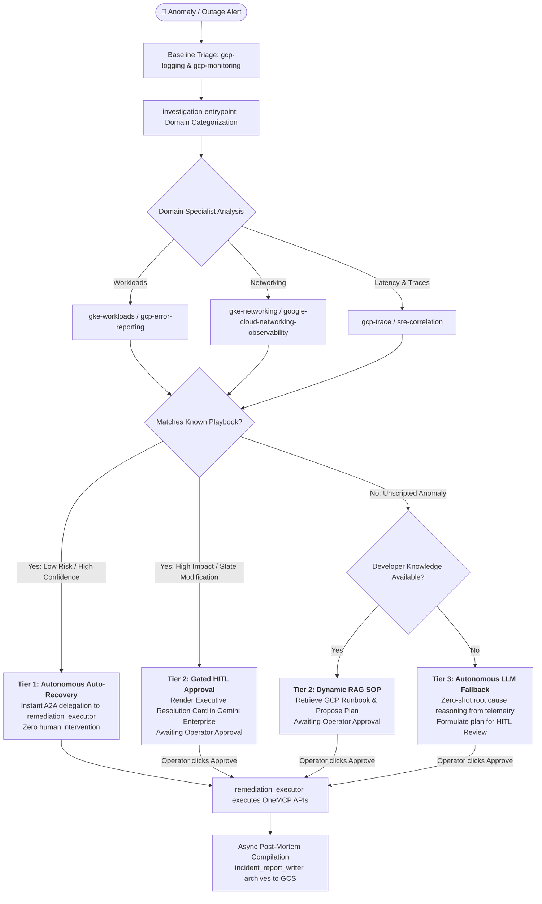

# 🛡️ NovaSRE — Autonomous Site Reliability Engineering Platform (ADK 2.0 & A2A)


Welcome to **NovaSRE**, an enterprise-grade autonomous Site Reliability Engineering (SRE) and self-healing infrastructure platform built on **Google Cloud Vertex AI Reasoning Engines (ADK 2.0)**, **Agent-to-Agent (A2A) Protocols**, and universal **OneMCP APIs**.

NovaSRE transforms cloud operations from reactive firefighting into proactive, policy-driven self-healing. The platform pairs a live **GKE Autopilot microservices cluster (`online-boutique`)** with autonomous AI agents that diagnose root causes, cross-correlate observability signals with BigQuery deployment ledgers, and execute surgical remediation under strict **least-privilege security** and **Human-in-the-Loop (`HITL`) approval gates**.

---

## 🏗️ 1. Platform Architecture & Workflow

The NovaSRE ecosystem consists of specialized Vertex AI Reasoning Engine agents registered with **Gemini Enterprise** as the operator front door, a 4-layer Modular Skill Repository, and universal OneMCP Gateways interacting securely across Google Cloud:

```mermaid
graph TD
    subgraph Gemini Enterprise [Operator Front Door: Gemini Enterprise]
        GE[Gemini Enterprise Console<br/>Natural-Language Chat, Routing<br/>& A2UI Human-in-the-Loop Approval]
    end

    subgraph Vertex AI Reasoning Engines [Google Cloud Vertex AI Serverless Agents]
        InvAgent[Investigator Agent<br/><b>rca_telemetry_expert</b><br/>Read-Only Diagnostician]
        RemAgent[Remediation Worker<br/><b>remediation_executor</b><br/>A2A Mutating Engine]
        DocAgent[Documentation Compiler<br/><b>incident_report_writer</b><br/>Post-Mortem Writer]
        SimAgent[Chaos Engine<br/><b>outage_simulator</b><br/>Chaos Engineering]
    end

    subgraph Modular Skill Ecosystem [app/skills/ & GCS Playbook Bucket]
        DiagSkills[Layer 1: Diagnostics & Triage<br/>10 Specialist Skills]
        PlaybookSkills[Layer 2: Recovery Playbooks<br/>8 SRE Remediation Playbooks]
        SimSkills[Layer 3: Chaos Simulations<br/>8 Outage Injection Playbooks]
        ReportSkills[Layer 4: Incident Reporting<br/>3 Post-Mortem Skills]
    end

    subgraph Universal OneMCP Gateway [Google Cloud OneMCP API Layer]
        LOG_MCP[Logging OneMCP<br/>logging.googleapis.com]
        MON_MCP[Monitoring OneMCP<br/>monitoring.googleapis.com]
        TRACE_MCP[Trace OneMCP<br/>cloudtrace.googleapis.com]
        ERR_MCP[Error Reporting OneMCP<br/>clouderrorreporting.googleapis.com]
        GKE_MCP[GKE OneMCP<br/>container.googleapis.com]
        COMPUTE_MCP[Compute & VPC OneMCP<br/>compute.googleapis.com]
        BQ_MCP[BigQuery OneMCP<br/>bigquery.googleapis.com]
        GCS_MCP[GCS OneMCP<br/>storage.googleapis.com]
    end

    subgraph Production Infrastructure [GCP & GKE Environment]
        GKE[GKE Autopilot Cluster: online-boutique<br/>12 Microservices under Synthetic Load]
        BQ[BigQuery Ledger<br/>sre_releases.recent_releases]
        GCS[GCS Bucket<br/>gs://project-telemetry & Playbooks]
    end

    %% Gemini Enterprise & Agent Interactions
    GE <-->|1. Trigger Alert / Natural Chat| InvAgent
    GE -->|2. Trigger Controlled Scenario| SimAgent
    GE -->|3. HITL Operator Approval| InvAgent

    %% Agent-to-Agent (A2A) and Worker Delegation
    InvAgent -->|A2A Protocol: Execute Approved Healing| RemAgent
    InvAgent -.->|Async Post-Mortem Compilation| DocAgent

    %% Skills Association
    InvAgent --- DiagSkills
    InvAgent --- PlaybookSkills
    SimAgent --- SimSkills
    DocAgent --- ReportSkills

    %% OneMCP Connections - Investigator
    InvAgent -->|Triage Logs & Metrics| LOG_MCP
    InvAgent -->|Query PromQL & Timeseries| MON_MCP
    InvAgent -->|Decompose Spans & Latency| TRACE_MCP
    InvAgent -->|Inspect Exception Groups| ERR_MCP
    InvAgent -->|Inspect Pod & Service State| GKE_MCP
    InvAgent -->|Audit VPC / NAT / Firewalls| COMPUTE_MCP
    InvAgent -->|Correlate Rollout History| BQ_MCP
    InvAgent -->|Load Remote SOPs| GCS_MCP

    %% OneMCP Connections - Workers & Simulators
    RemAgent -->|Declarative Workload Patches| GKE_MCP
    RemAgent -->|Declarative Router / Firewall Updates| COMPUTE_MCP
    SimAgent -->|Inject Workload / Network Failure| GKE_MCP
    DocAgent -->|Archive Markdown Reports| GCS_MCP

    %% OneMCP to Infrastructure
    LOG_MCP --> GKE
    MON_MCP --> GKE
    TRACE_MCP --> GKE
    ERR_MCP --> GKE
    GKE_MCP --> GKE
    COMPUTE_MCP --> GKE
    BQ_MCP --> BQ
    GCS_MCP --> GCS
```



### Core Agents & Roles Summary

1. **`rca_telemetry_expert` (The Diagnostician & Unified Investigator)**:
   * **Privilege Level**: Strictly **Read-Only**.
   * **Function**: Serves as the primary intelligence hub for incident response. Performs baseline triage via Cloud Logging and Cloud Monitoring, loads the generic `investigation-entrypoint` skill to categorize the failure domain, and conditionally loads specialized diagnostic skills (`gke-workloads`, `gke-networking`, `google-cloud-networking-observability`, `google-cloud-global-frontend-configuration`, `gcp-trace`, `gcp-error-reporting`, `sre-correlation`).
   * **Delegation**: When the root cause is isolated, it loads the corresponding SRE Playbook and delegates execution to `remediation_executor` via Google's Agent-to-Agent (A2A) protocol.

2. **`remediation_executor` (The Secure Healing Worker)**:
   * **Privilege Level**: **Write-Enabled** (`container.developer`, `compute.networkAdmin`).
   * **Function**: Operates as a dedicated, least-privilege execution agent exposed via the Vertex AI `A2aAgent` template. Receives structured healing commands over A2A, translates them into declarative OneMCP API operations (`patch_k8s_resource`, `update_router_nat`, `patch_firewall_rule`), verifies post-remediation health, and returns verified execution timestamps.

3. **`incident_report_writer` (The Documentation Compiler & Post-Mortem Expert)**:
   * **Privilege Level**: **Storage Write** (`storage.objectAdmin`).
   * **Function**: An autonomous technical writer that compiles comprehensive, publication-ready GitHub Flavored Markdown post-mortems following incident mitigation. Uses log-derived timestamps (`incident_start_time`, `detection_time`, `mitigation_executed_time`, `recovery_verified_time`) to generate chronological timeline tables without redundant secondary telemetry API calls, and automatically archives reports to Cloud Storage (`gs://<bucket>/reports/post_mortem_*.md`).

4. **`outage_simulator` (The Chaos Engineering Agent)**:
   * **Function**: An autonomous chaos engineering agent that dynamically loads simulation playbooks from `app/skills/simulations/` and injects controlled failure modes (pod crashes, replica downscales, bad image rollouts, CoreDNS outages, NetworkPolicy isolation, Cloud NAT port drops, and broken service routing) into the `online-boutique` GKE cluster.

> **Operator Front Door**: NovaSRE has no bespoke UI. Operators interact with the platform through **Gemini Enterprise**, where the `outage_simulator` and `rca_telemetry_expert` agents are registered (see §7). Gemini Enterprise handles natural-language chat, routing, and renders the **Human-in-the-Loop (`HITL`) approval widgets** (via A2UI) that gate Tier 2 remediation.

---

## 🌟 2. Comprehensive 8-Scenario Chaos & Self-Healing Matrix

NovaSRE provides 8 fully orchestrated scenarios spanning Kubernetes workloads, container rollouts, database availability, traffic routing, DNS resolution, and cloud network infrastructure:

| # | Scenario ID | Target Resource | Simulated Outage Action (`outage_simulator`) | SRE Recovery Playbook (`app/skills/playbooks/`) | Governance Tier & Execution Policy |
| :- | :--- | :--- | :--- | :--- | :--- |
| **1** | `gke-scale-outage` | `frontend` | Scales active replicas to **`0`** (`replicas: 0`) causing HTTP 503 errors across the store. | **Playbook 1 (`gke-scale-recovery`)**: Scale `frontend` back to `1` active replica. | **Tier 1 (Auto-Recovery)**<br>Pre-approved fast-path. Auto-healed via A2A. |
| **2** | `gke-bad-rollout` | `cartservice` | Deploys invalid container revision (`cartservice:broken-v2`) causing pod `CrashLoopBackOff`. | **Playbook 2 (`gke-crashloop-rollback`)**: Correlates BigQuery release ledger and reverts to previous stable image (`v1.0.4`). | **Tier 1 (Auto-Rollback)**<br>Causal deployment correlation fast-path. Auto-reverted via A2A. |
| **3** | `gke-dns-outage` | `coredns` (`kube-system`) | Scales CoreDNS to **`0`** replicas, inducing cluster-wide `.svc.cluster.local` resolution timeouts. | **Playbook 6 (`gke-dns-recovery`)**: Scale CoreDNS deployment back to `2` healthy replicas. | **Tier 1 (Auto-Recovery)**<br>Cluster infrastructure fast-path. Auto-scaled via A2A. |
| **4** | `gke-pod-crash` | `redis-cart` | Terminates active pods and simulates connection pool memory locks. | **Playbook 3 (`gke-pod-restart`)**: Execute clean rolling restart (`rollout restart deployment/redis-cart`). | **Tier 2 (HITL Approval)**<br>Requires operator approval before database disruption. |
| **5** | `gke-payment-latency` | `paymentservice` | Throttles capacity to `1 replica` under peak synthetic checkout surges, causing p99 latency `>2000ms`. | **Playbook 4 (`gke-horizontal-upsize`)**: Scale deployment up to **`3 replicas`** to absorb load. | **Tier 2 (HITL Approval)**<br>Requires operator approval for capacity/cost scaling. |
| **6** | `gke-network-firewall-block` | `checkoutservice` | Injects restrictive `NetworkPolicy` dropping all ingress and egress packets. | **Playbook 5 (`gke-network-firewall-recovery`)**: Delete blocking NetworkPolicy to restore pod networking. | **Tier 2 (HITL Approval)**<br>Requires operator confirmation to modify network policies. |
| **7** | `gcp-nat-port-drop` | `nat-gateway-us-central1` | Simulates Cloud NAT SNAT port exhaustion and outbound packet drop. | **Playbook 7 (`gcp-nat-port-recovery`)**: Increase `minPortsPerVm` from 64 to 256 on Cloud NAT gateway. | **Tier 2 (HITL Approval)**<br>Requires operator confirmation for VPC gateway reconfiguration. |
| **8** | `gke-service-routing-break` | `checkoutservice` (Service) | Patches K8s Service selector to invalid `app=broken-selector`, disconnecting endpoints. | **Playbook 8 (`gke-service-routing-recovery`)**: Restore Service selector to target `app=checkoutservice`. | **Tier 2 (HITL Approval)**<br>Requires operator confirmation to patch Service definitions. |

---

## 🛡️ 3. The 3-Tier Operational Resolution Hierarchy

NovaSRE balances execution speed with production safety through a strict 3-tier resolution hierarchy:



1. **Tier 1: Autonomous Auto-Remediation (High Confidence / Low Risk)**  
   * **Trigger**: Root cause analysis precisely correlates with an established auto-recovery playbook (e.g., zero-replica scale drops, CoreDNS capacity loss) or a verified bad rollout in the BigQuery deployment ledger.
   * **Execution Flow**: `rca_telemetry_expert` loads the playbook and delegates directly to `remediation_executor` via A2A. Cluster health is restored in seconds with zero operator intervention.

2. **Tier 2: Gated Human-in-the-Loop Remediation (High Impact / State Disruption)**  
   * **Trigger**: Root cause matches a playbook involving stateful disruption, database connection restarts, network policy deletion, capacity/cost scaling, or dynamic RAG SOP retrieval.
   * **Execution Flow**: The agent prepares an **Executive Resolution Brief** and renders an A2UI approval widget in Gemini Enterprise. Execution is held until an SRE reviews the evidence and clicks **`[ ✅ Approve & Execute ]`**.

3. **Tier 3: Autonomous Zero-Shot LLM Fallback (Zero-Day & Novel Anomalies)**  
   * **Trigger**: The anomaly does not match any pre-configured playbook or release ledger record.
   * **Execution Flow**: `rca_telemetry_expert` leverages Gemini reasoning to progressively interrogate error logs (`LOGGING_MCP_SERVER`), inspect metrics (`MONITORING_MCP_SERVER`), analyze trace spans (`TRACE_MCP_SERVER`), and audit Kubernetes resource manifests (`GKE_MCP_SERVER`). It formulates an unscripted recovery hypothesis and presents it to the operator for HITL review.

---

## 📚 4. Modular 4-Layer Skill Architecture (29 Skills)

NovaSRE is powered by 29 modular skills organized into 4 functional layers:

```
app/skills/
├── diagnostics/                                # Layer 1: Specialist Triage & Signal Skills (10 skills)
│   ├── investigation-entrypoint/SKILL.md       # Generic incident orchestrator & domain router
│   ├── sre-correlation/SKILL.md                # Cross-signal metric-log-trace & BigQuery pivot
│   ├── gke-workloads/SKILL.md                  # Pod lifecycle, CrashLoopBackOff, resource limits
│   ├── gke-networking/SKILL.md                 # Dataplane V2, CoreDNS, ClusterIP service routing
│   ├── gcp-logging/SKILL.md                    # Cloud Logging query design & timestamp extraction
│   ├── gcp-monitoring/SKILL.md                 # PromQL, timeseries alignment, alert inspection
│   ├── gcp-trace/SKILL.md                      # Distributed trace breakdown & latency waterfall
│   ├── gcp-error-reporting/SKILL.md            # Exception group stats & deduplicated stack traces
│   ├── google-cloud-networking-observability/  # VPC flow logs, firewall rules, Cloud NAT SNAT
│   └── google-cloud-global-frontend-config/    # Cloud Armor WAF, External ALBs, URL maps
│
├── playbooks/                                  # Layer 2: Targeted SRE Recovery Playbooks (8 playbooks)
│   ├── gke-scale-recovery/SKILL.md             # Playbook 1: Deployment scale recovery (Tier 1)
│   ├── gke-crashloop-rollback/SKILL.md         # Playbook 2: Bad rollout rollback via BQ (Tier 1)
│   ├── gke-pod-restart/SKILL.md                # Playbook 3: Redis pod rolling restart (Tier 2)
│   ├── gke-horizontal-upsize/SKILL.md          # Playbook 4: Payment horizontal scaling (Tier 2)
│   ├── gke-network-firewall-recovery/SKILL.md  # Playbook 5: NetworkPolicy unblock (Tier 2)
│   ├── gke-dns-recovery/SKILL.md               # Playbook 6: CoreDNS capacity recovery (Tier 1)
│   ├── gcp-nat-port-recovery/SKILL.md          # Playbook 7: Cloud NAT min-ports increase (Tier 2)
│   └── gke-service-routing-recovery/SKILL.md   # Playbook 8: K8s Service selector restore (Tier 2)
│
├── simulations/                                # Layer 3: Chaos Engineering Playbooks (8 simulations)
│   ├── gke-scale-outage/SKILL.md               # Sim 1: Scale frontend deployment to 0
│   ├── gke-bad-rollout/SKILL.md                # Sim 2: Invalidate cartservice image to broken-v2
│   ├── gke-pod-crash/SKILL.md                  # Sim 3: Terminate redis-cart pods & lock memory
│   ├── gke-payment-latency/SKILL.md            # Sim 4: Downscale paymentservice under surge load
│   ├── gke-network-firewall-block/SKILL.md     # Sim 5: Restrictive NetworkPolicy on checkout
│   ├── gke-dns-outage/SKILL.md                 # Sim 6: Scale CoreDNS to 0 replicas
│   ├── gcp-nat-port-drop/SKILL.md              # Sim 7: Cloud NAT SNAT port exhaustion
│   └── gke-service-routing-break/SKILL.md      # Sim 8: Inject broken selector on checkout Service
│
└── reporting/                                  # Layer 4: Post-Mortem & Incident Reporting (3 skills)
    ├── postmortem-generator/SKILL.md           # Log-derived timeline builder & report generator
    ├── postmortem-documentation/SKILL.md       # Premium Markdown styling & executive structure
    └── postmortem-aggregator/SKILL.md          # Multi-source diagnostic & A2A brief synthesis
```

---

## ⏱️ 5. Zero-Call Telemetry Timeline & Asynchronous Post-Mortems

To eliminate redundant API calls and prevent token bloat during post-incident documentation:

1. **Structured SRE Fact Extraction**: During baseline triage, `rca_telemetry_expert` extracts `incident_start_time` (first log error / metric anomaly) and `detection_time`.
2. **Verified Execution Timestamps**: When `remediation_executor` runs a fix, it records `mitigation_executed_time` and `recovery_verified_time`.
3. **Zero-Call Synthesis**: These 4 verified timestamps are packaged into a structured JSON SRE fact block:
   ```json
   {
     "alert": "CRITICAL ALERT: cartservice pod entering CrashLoopBackOff.",
     "root_cause": "Recent release REL-042 pushed broken container image revision cartservice:broken-v2.",
     "incident_start_time": "2026-08-07T20:12:04Z",
     "detection_time": "2026-08-07T20:12:18Z",
     "remediation_status": "SUCCESS",
     "recommended_action": "ROLLBACK",
     "target_resource": "deployments/cartservice",
     "severity": "CRITICAL"
   }
   ```
4. **Asynchronous Generation**: The UI spawns a non-blocking background thread for `incident_report_writer`. The report compiler builds the timeline table directly from session context—**making zero additional OneMCP telemetry calls**—and persists the final Markdown report to `gs://<bucket>/reports/post_mortem_<id>.md`.

---

## 📦 6. BigQuery Deployment Ledger Correlation

When container failures occur (`e.g., cartservice entering CrashLoopBackOff`), NovaSRE performs **Causal Deployment Correlation**:

1. Queries the BigQuery deployment ledger via OneMCP (`BQ_MCP_SERVER`):
   ```sql
   SELECT release_id, service_name, container_image, git_commit, deployed_by, timestamp_utc
   FROM `sre_releases.recent_releases`
   WHERE service_name = 'cartservice'
   ORDER BY timestamp_utc DESC
   LIMIT 1;
   ```
2. Identifies that release **`REL-042`** deployed `cartservice:broken-v2` immediately prior to the anomaly.
3. Automatically triggers **Playbook 2 (Tier 1 Rollback)** (`gke-crashloop-rollback`) to revert to the last stable release (`v1.0.4`) without manual guesswork.

---

## 🚀 7. Comprehensive Deployment Guide

You can deploy NovaSRE to either a **new Google Cloud project** or an **existing project** using our modular Terraform suite (`terraform/`).

* **⏱️ Estimated Deployment Time:** **`~10 to 12 minutes`** for a full stack deployment to a new project, or **`~6 to 8 minutes`** when deploying only the SRE agents to an existing project.

### Prerequisites
* Google Cloud CLI (`gcloud`) installed and authenticated (`gcloud auth login`).
* Python `3.13+` and `terraform >= 1.5.0`.
* A Google Cloud Billing Account ID (`gcloud billing accounts list`).

---

### Path A: Deploy to a New Google Cloud Project
If starting fresh, create a new project and provision the full infrastructure (VPC, GKE Autopilot cluster, BigQuery database, and GCS bucket):

```bash
# 1. Create a new GCP project and link billing
export GCP_PROJECT_ID="ksiri-novasre"
export BILLING_ACCOUNT_ID="your-billing-account-id"
export GCP_REGION="us-central1"

gcloud projects create $GCP_PROJECT_ID
gcloud billing projects link $GCP_PROJECT_ID --billing-account=$BILLING_ACCOUNT_ID

# 2. Configure local environment variables
cat <<EOF > .env
GCP_PROJECT_ID="$GCP_PROJECT_ID"
GOOGLE_CLOUD_LOCATION="$GCP_REGION"
GEMINI_MODEL="gemini-3.7-flash"
EOF

# 3. Initialize and apply Terraform (provisions VPC, GKE, BigQuery seed, and GCS Playbooks)
cd terraform
terraform init
terraform apply -var="gcp_project_id=$GCP_PROJECT_ID" -var="gcp_region=$GCP_REGION" -var="deploy_infrastructure=true" -auto-approve

# 4. Deploy Vertex AI Reasoning Engines (Investigator, Remediation, and Simulator)
cd ..
python3 deploy_a2a.py
```

Once the agents are deployed, register them with Gemini Enterprise so operators can reach them (see [Post-Deployment: Register Agents with Gemini Enterprise](#post-deployment-register-agents-with-gemini-enterprise)).

---

### Path B: Deploy to an Existing Google Cloud Project
If deploying into an existing project where VPC and GKE infrastructure are already running, disable infrastructure provisioning and deploy only the SRE agents:

```bash
export GCP_PROJECT_ID="your-existing-project-id"
export GCP_REGION="us-central1"

# 1. Apply Terraform with infrastructure creation disabled
cd terraform
terraform init
terraform apply -var="gcp_project_id=$GCP_PROJECT_ID" -var="gcp_region=$GCP_REGION" -var="deploy_infrastructure=false" -auto-approve

# 2. Deploy AI Agents
cd ..
python3 deploy_a2a.py
```

Then register the agents with Gemini Enterprise (see [Post-Deployment: Register Agents with Gemini Enterprise](#post-deployment-register-agents-with-gemini-enterprise)).

---

### Post-Deployment: Register Agents with Gemini Enterprise

Operators interact with NovaSRE through **Gemini Enterprise**, which acts as the front door for chat, routing, and Human-in-the-Loop (HITL) approvals. After the Reasoning Engines are deployed, register the agents so they are discoverable and callable from Gemini Enterprise.

> [!IMPORTANT]
> Only **two** agents need to be registered with Gemini Enterprise: the **`outage-simulator`** and the **`rca-telemetry-expert`**. The `remediation-executor` and `incident-report-writer` are never called directly by an operator — they are invoked internally by the RCA agent over the Agent-to-Agent (A2A) protocol — so they are **not** registered.

#### Step 0: Retrieve the numeric Reasoning Engine URNs

Gemini Enterprise (like all Vertex AI Reasoning Engine invocations) requires the **numerical resource URN** (e.g., `projects/1234567890/locations/us-central1/reasoningEngines/9876543210`) rather than the string display name. Extract the live URNs generated during deployment:

```bash
# Retrieve the project number
export GCP_PROJECT_NUM=$(gcloud projects describe $GCP_PROJECT_ID --format="value(projectNumber)")

# Extract active numeric URNs from the Vertex AI Reasoning Engine registry
export SIM_URN=$(curl -s -H "Authorization: Bearer $(gcloud auth print-access-token)" "https://${GCP_REGION}-aiplatform.googleapis.com/v1beta1/projects/${GCP_PROJECT_NUM}/locations/${GCP_REGION}/reasoningEngines" | grep -B 1 '"displayName": "outage-simulator"' | grep 'projects/' | grep -o 'projects/[^"]*')
export RCA_URN=$(curl -s -H "Authorization: Bearer $(gcloud auth print-access-token)" "https://${GCP_REGION}-aiplatform.googleapis.com/v1beta1/projects/${GCP_PROJECT_NUM}/locations/${GCP_REGION}/reasoningEngines" | grep -B 1 '"displayName": "rca-telemetry-expert"' | grep 'projects/' | grep -o 'projects/[^"]*')

echo "Outage Simulator URN: $SIM_URN"
echo "RCA Telemetry Expert URN: $RCA_URN"
```

#### Step 1: Create a GCP OAuth web client (for 3LO)

The RCA agent is registered as a custom A2A agent that authenticates on behalf of the operator using **three-legged OAuth (3LO)**. Create an **OAuth 2.0 Web application client** in the Google Cloud console (**APIs & Services → Credentials → Create Credentials → OAuth client ID → Web application**) and record the generated **Client ID** and **Client Secret**.

You will supply these credentials, along with the following endpoints, when registering the RCA agent in Step 4:

| Field | Value |
| :--- | :--- |
| **Authorization URL** | `https://accounts.google.com/o/oauth2/auth?access_type=offline&prompt=consent` |
| **Token URL** | `https://oauth2.googleapis.com/token` |
| **Scope** | `https://www.googleapis.com/auth/cloud-platform` |

#### Step 2: Register the Outage Simulator (custom agent via Agent Runtime)

Register the `outage-simulator` in Gemini Enterprise as a **custom agent via Agent Runtime**. It does **not** require any authorization details — supply only its numeric URN (`$SIM_URN`) and a brief description, for example:

> *"NovaSRE Chaos Engine. Injects controlled failure modes (pod crashes, replica downscales, bad rollouts, DNS outages, NetworkPolicy isolation, Cloud NAT port drops, and broken service routing) into the `online-boutique` GKE cluster for demonstration and testing."*

#### Step 3: Register the RCA Telemetry Expert (custom A2A agent)

Register the `rca-telemetry-expert` in Gemini Enterprise as a **custom A2A agent**, providing the OAuth client credentials from Step 1 together with the Authorization URL, Token URL, and Scope from that same table.

Use the agent card below, substituting `{LOCATION}`, `{PROJECT_NUMBER}`, and `{REASONING_ENGINE_ID}` with the values from your `$RCA_URN` (i.e., the `url` must resolve to the numeric URN followed by `/a2a`):

```json
{
  "name": "rca-telemetry-expert",
  "description": "The SRE RCA Telemetry Expert agent. Performs root-cause analysis, cross-correlates observability signals, and delegates GKE remediation under HITL gating.",
  "version": "1.0",
  "protocolVersion": "0.3.0",
  "url": "https://{LOCATION}-aiplatform.googleapis.com/v1beta1/projects/{PROJECT_NUMBER}/locations/{LOCATION}/reasoningEngines/{REASONING_ENGINE_ID}/a2a",
  "capabilities": { "streaming": true },
  "defaultInputModes": ["text/plain"],
  "defaultOutputModes": ["text/plain"],
  "skills": [],
  "preferredTransport": "HTTP+JSON"
}
```

Once both agents are registered, operators can trigger simulations and autonomous investigations directly from the Gemini Enterprise console, and approve Tier 2 remediation via the A2UI HITL widgets rendered inline.

---

## 🧪 8. How to Simulate Failures & Test

You can verify and demonstrate the complete **NovaSRE** self-healing architecture either from the **Gemini Enterprise** console or directly via the terminal using the Vertex AI REST endpoints.

---

### Option A: Test via Gemini Enterprise

Once the `outage-simulator` and `rca-telemetry-expert` agents are registered (see §7), operators can run the full demo conversationally from the Gemini Enterprise console:

1. **Trigger an Outage Simulation**: Ask the `outage-simulator` agent to run a scenario (e.g., *"Run the `gke-scale-outage` simulation — scale the `frontend` deployment to 0 replicas."*). The Chaos Engine executes the exact failure on GKE.
2. **Trigger Autonomous Investigation & HITL Approval**: Ask the `rca-telemetry-expert` agent to investigate (e.g., *"`frontend` is returning HTTP 503 — investigate and remediate."*).
   * **If Tier 1 (Auto-Recovery)**: The agent heals the cluster immediately and confirms recovery.
   * **If Tier 2 (Manual HITL)**: The agent renders an **A2UI `⚡ Proposed Recovery Action`** approval widget inline. Click **`✅ Approve & Execute`**. The Remediation Worker executes the fix over A2A, confirms pod readiness, and compiles the **Markdown Post-Mortem Report** asynchronously to GCS.

---

### Option B: Test via the Terminal (Direct cURL & REST API Verification)

You can run an end-to-end verification directly from your terminal (`bash`) by querying the serverless Vertex AI Reasoning Engine REST endpoints (`:streamQuery`) using `curl` and your Google Cloud OAuth token. This simulates a complete **Tier 1 Scale Outage (`gke-scale-outage`)** and verifies autonomous self-healing via Agent-to-Agent (`A2A`) delegation.

#### 1. Verify Initial GKE Cluster State
Ensure the target microservice (`frontend`) is active (`1/1` replicas) before starting:
```bash
kubectl get deployment frontend -n default
```
*Expected Output:*
```text
NAME       READY   UP-TO-DATE   AVAILABLE   AGE
frontend   1/1     1            1           11h
```

#### 2. Trigger the Outage via `outage-simulator` using `curl`
Execute the following `curl` command to call the remote `outage-simulator` Reasoning Engine (`4620976341926281216`). This instructs the Chaos Engine over HTTP/JSON to load the `gke-scale-outage` skill and scale `frontend` to 0 replicas over A2A:
```bash
curl -s -X POST \
  -H "Authorization: Bearer $(gcloud auth print-access-token)" \
  -H "Content-Type: application/json" \
  "https://us-central1-aiplatform.googleapis.com/v1beta1/projects/1047367951597/locations/us-central1/reasoningEngines/4620976341926281216:streamQuery" \
  -d '{
    "input": {
      "user_id": "sre",
      "message": {
        "role": "user",
        "parts": [{"text": "Load the gke-scale-outage skill and execute the Tier 1 outage simulation right now. Scale deployment frontend in namespace default in cluster online-boutique in region us-central1 to 0 replicas."}]
      }
    },
    "classMethod": "stream_query"
  }'
```
*Expected Streamed Response Confirmation:*
```text
OUTAGE SIMULATION SUCCESSFUL: GKE Deployment 'frontend' has been scaled to 0 active replicas. Alert condition triggered.
```

#### 3. Confirm Outage State in GKE
Verify via `kubectl` that the active pods have dropped to `0`:
```bash
kubectl get deployment frontend -n default
```
*Expected Output:*
```text
NAME       READY   UP-TO-DATE   AVAILABLE   AGE
frontend   0/0     0            0           11h
```

#### 4. Trigger Autonomous Investigation & Self-Healing via `rca-telemetry-expert` using `curl`
Now call the remote `rca-telemetry-expert` Reasoning Engine (`6684750871168811008`) using `curl` without passing a pre-created `session_id` (allowing the receiving serverless container pod to auto-create its local session in memory on demand). The agent queries GKE via MCP tools, diagnoses `replicas: 0`, and autonomously delegates across A2A (`remediation_executor_remote`) to restore the service:
```bash
curl -s -X POST \
  -H "Authorization: Bearer $(gcloud auth print-access-token)" \
  -H "Content-Type: application/json" \
  "https://us-central1-aiplatform.googleapis.com/v1beta1/projects/1047367951597/locations/us-central1/reasoningEngines/6684750871168811008:streamQuery" \
  -d '{
    "input": {
      "user_id": "sre",
      "message": {
        "role": "user",
        "parts": [{"text": "CRITICAL ALERT: frontend service active replicas = 0. HTTP 503 errors detected across online-boutique. Investigate the root cause immediately and delegate autonomous self-healing remediation over A2A (`remediation_executor_remote`) to scale the frontend deployment in namespace default to 1 replica right now."}]
      }
    },
    "classMethod": "stream_query"
  }'
```
*Expected Streamed Response Confirmation:*
```json
{
  "alert": "CRITICAL ALERT: frontend service active replicas = 0. HTTP 503 errors detected across online-boutique.",
  "root_cause": "The root cause appears to be that the `frontend` deployment was scaled down to 0 replicas, causing the service to be unavailable and return HTTP 503 errors.",
  "remediation_status": "SUCCESS",
  "recommended_action": "SCALE_UP",
  "target_resource": "deployments/frontend",
  "severity": "CRITICAL"
}
```

#### 5. Verify Full System Recovery in Terminal
Run a final terminal check to confirm that the `frontend` microservice has been scaled back up and is `Ready: 1/1`:
```bash
kubectl get deployment frontend -n default
```
*Expected Output:*
```text
NAME       READY   UP-TO-DATE   AVAILABLE   AGE
frontend   1/1     1            1           11h
```

---

## 🛠️ 9. Extensibility: How to Expand the Platform for New Issues

Because NovaSRE is built upon **Modular Markdown Skills (`SKILL.md`)** and the **Model Context Protocol (MCP)**, expanding the platform to simulate, triage, and remediate brand-new failure scenarios is completely decoupled from core agent code. You do not need to retrain models or modify core Python orchestration logic.

To add a new autonomous capability, complete three lightweight steps:

1. **Author a Chaos Simulation Skill**: Create a new folder under `app/skills/simulations/<your-new-scenario>/SKILL.md`. Document the exact failure injection routine in readable GitHub Flavored Markdown (e.g., injecting CPU saturation, editing resource limits, or introducing network loss via `kubectl`).
2. **Author a Remediation Playbook**: Create the corresponding diagnostic SOP under `app/skills/playbooks/<your-new-scenario>/SKILL.md`. Document the target symptoms, causal telemetry indicators, and exact recovery commands (`kubectl`, `gcloud`, etc.). When you run `terraform apply`, this playbook is automatically seeded into your central Google Cloud Storage repository (`GCS_MCP_SERVER`).
3. **Assign a Governance Tier**: Reference the new scenario ID in the corresponding SRE Playbook and assign its operational governance policy (Tier 1 for immediate Auto-Remediation or Tier 2 for gated HITL confirmation). Operators invoke the scenario by name through the `outage-simulator` and `rca-telemetry-expert` agents in Gemini Enterprise — no UI changes are required.

Once updated, the Vertex AI Reasoning Engines automatically discover, parse, and orchestrate your new skills on demand via their conversational MCP server attachments.

---

## 📄 License
Copyright (c) 2026 siri2421. All rights reserved.
Licensed under the Apache-2.0 License.
