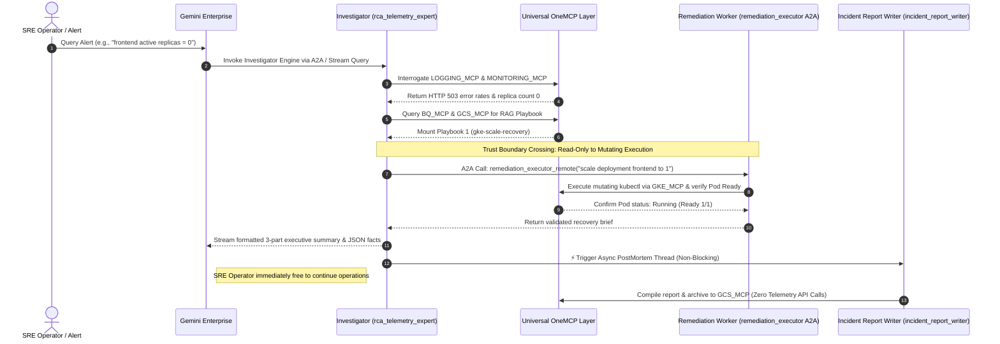
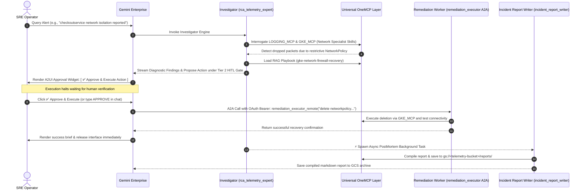

# 🏗️ NovaSRE Platform Architecture & Workflow Deep-Dive

This document details the design methodology, operational trust boundaries, universal API standardizations, and request workflows of the **NovaSRE** autonomous self-healing engineering platform. The architecture adheres to Google SRE AI Ops engineering principles by decomposing trust boundaries, standardizing model-environment interactions via universal **OneMCP** servers, and grounding diagnostic reasoning via **Retrieval-Augmented Generation (RAG)** playbooks.

---

## 🏛️ 1. Architectural Principles & Best Practices

To achieve enterprise-grade reliability, zero-day diagnostic depth, and rigid security compliance across live Google Cloud and Kubernetes environments, NovaSRE enforces four foundational design directives:

```mermaid
graph TD
    subgraph Gemini Enterprise [Operator Front Door: Gemini Enterprise]
        GE[Gemini Enterprise Console<br/>Natural-Language Chat, Routing<br/>& A2UI Human-in-the-Loop Approval]
    end

    subgraph Vertex AI Reasoning Engines [Google Cloud Vertex AI Serverless Agents]
        InvAgent[Investigator Agent<br/><b>rca_telemetry_expert</b><br/>Read-Only Diagnostician]
        RemAgent[Remediation Worker<br/><b>remediation_executor</b><br/>A2A Mutating Engine]
        DocAgent[Documentation Compiler<br/><b>incident_report_writer</b><br/>Post-Mortem Writer]
        SimAgent[Chaos Engine<br/><b>outage_simulator</b><br/>Chaos Engineering]
    end

    subgraph Modular Skill Ecosystem [app/skills/ & GCS Playbook Bucket]
        DiagSkills[Layer 1: Diagnostics & Triage<br/>10 Specialist Skills]
        PlaybookSkills[Layer 2: Recovery Playbooks<br/>8 SRE Remediation Playbooks]
        SimSkills[Layer 3: Chaos Simulations<br/>8 Outage Injection Playbooks]
        ReportSkills[Layer 4: Incident Reporting<br/>3 Post-Mortem Skills]
    end

    subgraph Universal OneMCP Gateway [Google Cloud OneMCP API Layer]
        LOG_MCP[Logging OneMCP<br/>logging.googleapis.com]
        MON_MCP[Monitoring OneMCP<br/>monitoring.googleapis.com]
        TRACE_MCP[Trace OneMCP<br/>cloudtrace.googleapis.com]
        ERR_MCP[Error Reporting OneMCP<br/>clouderrorreporting.googleapis.com]
        GKE_MCP[GKE OneMCP<br/>container.googleapis.com]
        COMPUTE_MCP[Compute & VPC OneMCP<br/>compute.googleapis.com]
        BQ_MCP[BigQuery OneMCP<br/>bigquery.googleapis.com]
        GCS_MCP[GCS OneMCP<br/>storage.googleapis.com]
    end

    subgraph Production Infrastructure [GCP & GKE Environment]
        GKE[GKE Autopilot Cluster: online-boutique<br/>12 Microservices under Synthetic Load]
        BQ[BigQuery Ledger<br/>sre_releases.recent_releases]
        GCS[GCS Bucket<br/>gs://project-telemetry & Playbooks]
    end

    %% Gemini Enterprise & Agent Interactions
    GE <-->|1. Trigger Alert / Natural Chat| InvAgent
    GE -->|2. Trigger Controlled Scenario| SimAgent
    GE -->|3. HITL Operator Approval| InvAgent

    %% Agent-to-Agent (A2A) and Worker Delegation
    InvAgent -->|A2A Protocol: Execute Approved Healing| RemAgent
    InvAgent -.->|Async Post-Mortem Compilation| DocAgent

    %% Skills Association
    InvAgent --- DiagSkills
    InvAgent --- PlaybookSkills
    SimAgent --- SimSkills
    DocAgent --- ReportSkills

    %% OneMCP Connections - Investigator
    InvAgent -->|Triage Logs & Metrics| LOG_MCP
    InvAgent -->|Query PromQL & Timeseries| MON_MCP
    InvAgent -->|Decompose Spans & Latency| TRACE_MCP
    InvAgent -->|Inspect Exception Groups| ERR_MCP
    InvAgent -->|Inspect Pod & Service State| GKE_MCP
    InvAgent -->|Audit VPC / NAT / Firewalls| COMPUTE_MCP
    InvAgent -->|Correlate Rollout History| BQ_MCP
    InvAgent -->|Load Remote SOPs| GCS_MCP

    %% OneMCP Connections - Workers & Simulators
    RemAgent -->|Declarative Workload Patches| GKE_MCP
    RemAgent -->|Declarative Router / Firewall Updates| COMPUTE_MCP
    SimAgent -->|Inject Workload / Network Failure| GKE_MCP
    DocAgent -->|Archive Markdown Reports| GCS_MCP

    %% OneMCP to Infrastructure
    LOG_MCP --> GKE
    MON_MCP --> GKE
    TRACE_MCP --> GKE
    ERR_MCP --> GKE
    GKE_MCP --> GKE
    COMPUTE_MCP --> GKE
    BQ_MCP --> BQ
    GCS_MCP --> GCS
```

### 1. Decomposed Trust Boundaries (Least-Privilege Separation)
A critical pattern in AI Ops incident management is ensuring that diagnostic agents cannot inadvertently mutate production state, while remediation execution workers operate only upon explicit, verified diagnostic or human authorization. NovaSRE splits operations into distinct security trust boundaries:
* **The Read-Only Investigation Boundary (`rca_telemetry_expert`)**: Equipped exclusively with read-only Cloud Logging, Cloud Monitoring, Cloud Trace, Kubernetes workload inspection, and BigQuery deployment ledger permissions. It can interrogate telemetry and formulate root causes but lacks physical API authorization to mutate cluster resources.
* **The Mutating Remediation Boundary (`remediation_executor`)**: An isolated worker identity endowed with mutating Kubernetes and Google Cloud API permissions (`container.developer`, `compute.networkAdmin`). It executes pre-approved healing maneuvers ONLY when invoked via secure Agent-to-Agent (A2A) protocol with OAuth 2.0 Bearer token verification.

### 2. Standardized Integration via Universal OneMCP Gateways
Rather than hardcoding fragile client SDKs or arbitrary HTTP endpoints, all agents communicate with cloud infrastructure through universal **Google Cloud OneMCP (Model Context Protocol)** servers over streamable HTTP+SSE connections:
* `logging.googleapis.com/mcp` & `monitoring.googleapis.com/mcp`: Standardized metric queries and log event extractions.
* `cloudtrace.googleapis.com/mcp` & `clouderrorreporting.googleapis.com/mcp`: Distributed trace decomposition and exception group analysis.
* `container.googleapis.com/mcp`: Standardized Kubernetes pod, deployment, service, and network policy inspection/mutation.
* `compute.googleapis.com/mcp`: Standardized VPC router, Cloud NAT, firewall rule, and URL map inspection/mutation.
* `bigquery.googleapis.com/mcp` & `storage.googleapis.com/mcp`: Standardized release database correlation and playbook/report archival.

### 3. RAG Grounding via Modular Markdown Playbooks
To prevent LLM hallucination during high-severity production outages, diagnostic reasoning is strictly grounded via **Retrieval-Augmented Generation (RAG)**. When an anomaly is detected, the Investigator dynamically mounts standard operating procedures (`SKILL.md`) from a central Google Cloud Storage repository (`GCS_MCP_SERVER`), mapping symptoms directly to verified organizational healing commands before execution.

### 4. Unified Workload & Network Specialization (Zero-Latency Triage)
Rather than splitting network investigations into a separate network agent that introduces latency and unnecessary A2A serialization hops, all advanced networking diagnostic skills (`google-cloud-networking-observability`, `gke-networking`, `google-cloud-global-frontend-configuration`) are embedded directly into the unified **Investigator Agent (`rca_telemetry_expert`)**. Whether an outage stems from application memory exhausts, eBPF packet drops, Cloud NAT SNAT port exhaustion, or WAF security policy blocks, a single read-only investigator conducts complete stack triage instantly.

### 5. Asynchronous, Non-Blocking Postmortem Archival
Compiling detailed post-mortem documentation should never block an SRE operator from closing an incident or investigating subsequent alerts. The **Incident Report Writer Agent (`incident_report_writer`)** executes asynchronously in a background runtime immediately upon remediation verification, generating log-derived timeline tables and archiving the final Markdown document directly to GCS (`gs://<telemetry-bucket>/reports/`) without pausing the primary user interface.

---

## 🛡️ 2. Core Agent Matrix & Trust Topology

| Pillar | Agent Name & URN | Trust Boundary & IAM Scope | Core Embedded Skills & Capabilities | Primary Invocation Mode |
| :--- | :--- | :--- | :--- | :--- |
| **Investigation** | `rca_telemetry_expert` | **Read-Only Trust Boundary** (`viewer`, `logging.viewer`, `monitoring.viewer`, `cloudtrace.viewer`, `errorreporting.viewer`) | Unified Application & Network Diagnostics (`investigation-entrypoint`, `gcp-logging`, `gcp-monitoring`, `sre-correlation`, `gke-workloads`, `google-cloud-networking-observability`, `gke-networking`, `google-cloud-global-frontend-configuration`, `gcp-trace`, `gcp-error-reporting`) + all 8 Recovery Playbooks. | Direct conversational invocation from Gemini Enterprise or Supervisor. |
| **Remediation** | `remediation_executor` | **Mutating Trust Boundary** (`container.developer`, `compute.networkAdmin`) | Declarative GKE workload patching, image rollbacks, rolling restarts, CoreDNS scaling, NetworkPolicy unblocking, Service selector restoration, and Cloud NAT gateway updates. | Secure A2A delegation from Investigator or HITL approval-widget callback. |
| **Documentation** | `incident_report_writer` | **Reporting Boundary** (`storage.objectAdmin` on telemetry bucket) | Automated Markdown compilation (`postmortem-generator`, `postmortem-documentation`, `postmortem-aggregator`), log-derived timeline extraction, and GCS object archival. | **Asynchronous Non-Blocking Trigger** spawned upon remediation verification. |
| **Chaos Engine** | `outage_simulator` | **Simulation Sandbox Boundary** (`container.developer` on target namespace) | Controlled synthetic fault injection (`gke-scale-outage`, `gke-bad-rollout`, `gke-pod-crash`, `gke-payment-latency`, `gke-network-firewall-block`, `gke-dns-outage`, `gcp-nat-port-drop`, `gke-service-routing-break`). | Explicit conversational invocation from Gemini Enterprise or terminal command. |

---

## 🔄 3. Request Workflow & Execution Sequences

### Sequence 1: Autonomous Auto-Remediation (Tier 1 Fast-Path)
When an issue occurs that matches pre-approved low-risk SOPs (such as stateless replica scaling or reverting broken container rollout deployments), the entire detection-to-recovery cycle occurs autonomously in seconds:

---

### Sequence 2: Gated Human-in-the-Loop Remediation (Tier 2 & Network Configuration)
When an anomaly requires stateful disruption, resource quota adjustments, or complex firewall / Cloud NAT rule changes, the Investigator halts execution at the trust boundary and renders an interactive A2UI HITL approval widget in Gemini Enterprise:

---

## 📑 4. Telemetry & Log-Derived Timeline Integrity

A core tenet of the **NovaSRE** reporting engine is eliminating arbitrary or imprecise UI click timestamps from incident documentation. During the investigation and asynchronous documentation phases, agents utilize the `LOGGING_MCP_SERVER` (`list_log_entries`) to query direct cloud infrastructure logs and extract exact ISO 8601 timestamps:
1. **`incident_start_time`**: Extracted directly from the timestamp of the earliest matching application crash, memory leak, or dropped packet log event.
2. **`root_cause_log_timestamp`**: Extracted from the fatal stack trace or firewall drop entry identifying the causal bug.
3. **`mitigation_verified_time`**: Extracted from Kubernetes event logs confirming workload transition to `Ready: 1/1` or healthy network connectivity test completion.

These immutable log timestamps are synthesized into structured markdown tables inside the compiled post-mortem reports archived to GCS, without requiring human data entry or blocking live operational workflows.
